# pipes


**Pipes** is a modular framework designed for CI/CD, meticulously crafted in TypeScript. Its primary aim is to assist teams in developing a scalablen testable and human-readable deployment process, while emphasizing the importance of creating highly reusable components.

Here are the core components of Pipes:

- A highly modular runner, with, states, configuration, locking mechanism and storage, using Dagger to run the code anywhere!

- An extended version of Zod, which is a schema validation library. Our extension enriches Zod's capabilities, tailoring it to the specific needs of our CI/CD processes.

- A loader using SWC to speed up development and building.

- A JSX renderer for creating Typesafe output for everything related to CI, from console to Markdown summary.

- All functionalities and tools highly integrated to deliver a seamless deployment experience.


## Prerequisites

Before getting started with **Pipes**, ensure you have the following setup:

- **Docker or Podman**: These are essential for creating isolated environments, ensuring that software runs uniformly across different platforms.

  - Install [Docker](https://docs.docker.com/get-docker/) or [Podman](https://podman.io/getting-started/installation).
  - Check installation:
    ```bash
    docker --version
    # or
    podman --version
    ```

- **Node.js 20.5.0**: We're specifically targeting version 20.5.0 to ensure compatibility and smooth operations.
  - Install [Node.js](https://nodejs.org/en/).
  - We recommend using [nvm](https://github.com/nvm-sh/nvm) to easily switch between Node.js versions. Here's a guide on [how to set it up](https://github.com/nvm-sh/nvm#installing-and-updating).
  - Check installation and version:
    ```bash
    node --version
    ```
- **Yarn** When using Node.js 20 you only need to enable [corepack](https://nodejs.org/dist/latest/docs/api/corepack.html):
  ```bash
  corepack enable
  ```

After setting up the above prerequisites, you're ready to dive into **Pipes**!

## Installation

### Examples

# Development

## Essential Tools and Technologies in Pipes

Pipes is not just a product of core programming but is also shaped by various tools and technologies that provide it with added functionality, performance improvements, and ease of development. This chapter dives into some of those essential tools that are intertwined with the Pipes ecosystem.

- **dagger.io** - Dagger is a programmable CI/CD engine that runs your pipelines in containers. This gives us the benefits of having easy way to test, port the runners anywhere, and use everything that Docker supports to aid us in the creating the CI/CD.
- **typescript** - TypeScript is a super-set of JavaScript that adds static types. It's foundational to Pipes
- **SWC** - supercharges the Pipes compilation process. It's a lightning-fast TypeScript and JavaScript compiler that ensures optimal performance.
- **Node.js Test Runner** - By using Node.js test-runner we can easily make pipelines and modules testable without adding any overweight.
- **Zod** - Zod offers runtime validation ensuring that the data aligns with the expected types, safeguarding against potential type errors.

  > **USE ZOD**
  >
  > It is not only a good idea, but you are forced to.
  >
  > Use the zod package included or the `z` function exported from some helpers.
  >
  

Zod is crucial for everything in Pipes. It is used for validating input and output.

Zod has been extended in Pipes so it can easily use type-safe env and arguments, for example:

```ts
z.string().default("fallback default", {
  env: "env-name",
  arg: {
    long: "long-argument-name",
    short: "s",
  },
});
```

The "fallback default" can be undefined if no fallback is required. ZodDefault can also be used without defining env and arg and skipping this feature altogether.

- **MobX** simplifies state management in Pipes. It offers: Automatically updates relevant components when the state changes.

- **JSX** is a syntax extension for JavaScript, primarily used with React, allowing for writing UI components using a syntax that looks similar to XML. In Pipes, this provides a clean testable structure to do multiple things like: PR comments, CI logs or Markdown summary.

## Modules

Pipes has an extendable architecture and encourages devops/developers to create reusuable modules. Modules are core to our vision.

A typical module in this architecture consists of four main parts:

### Typescript interfaces for Config and Context.
  - **Defintion**
    - **Config** Primitive values: literal, string, numbers, boolean or array of those.
    - **Context** Objects and functions.
  - **How** Basic [interfaces](https://www.typescriptlang.org/docs/handbook/interfaces.html). Functions in context always accept 2-3 parameters: context, config and value (optional), but only the last one should be defined.
  - **Example** [See here](#typescript-interface-for-config-and-context)
  
### ModuleDef


| Category | Description |
|--|--|
|**Definition**|A definition of how the module, context and config should be. This is essentially to create the Zod parser for context and config, and then the Module itself.|
|**Prerequisite**|- Config interface <br /> -  Context interface<br />- Required modules *(optional)*<br />- Optional modules *(optional)*<br/> |


  This not only parses `Config` and `Context` but also adds definition from required and optional modules.

  - **Created with** [createModuleDef](#createmoduledef) .
  - **Example** [Typescript type for Module](#typescript-type-for-module)

### Config and Context parsers.

  - **Definition**
    - **Config parser** Created with helper utility and defines defaults and how config is parsed. Helper utility exports zod.
    - **Context parser** Created with helper utility and defined defaults and how context is parsed. Helper utility exports zod and a function helper.
    - **Prerequisite**
      - **ModuleDef**
    

  This is used on runtime to parse context and config. 

  - **How** 
    - **Config parser** Use [createConfig](https://github.com/island.is/pipes#createconfig).
    - **Context parser** Use [createContext](https://github.com/island.is/pipes#createcontext).
  - **Example** [See here](https://github.com/island.is/pipes#creating-config-and-context-parsers)

### Module.

  - **Definition**
    - **Module** A module includes name of the module, context, config, and string of required and optional modules.
  - **Prerequisite**
    - **ModuleDef**
    - **Config parser**
    - **Context parser** 

    This object, with Moduledef, is passed to the class to extend it's capabilities.

    - **How**  Use [createModule](#createmodule)
    - **Example** [See here](#creating-module)

## Example Module

### Typescript interface for Config and Context

It's imperative to define types for both the Module's Config and its Context using both Zod and TypeScript. Here's why this dual-typing approach is essential:

Robustness: By enforcing strong typing across the board, we ensure the integrity and predictability of our code. It's a principle of "better safe than sorry."

Circular Dependencies: Relying solely on Zod could lead to intricate circular errors. This is especially true since the context and its associated functions (fn) are interdependent.

Runtime Validation: TypeScript interfaces are fantastic for compile-time type checking, but they don't offer runtime validation. Zod fills this gap, ensuring that our runtime data aligns with our expected types.

#### Config

`Config ` provides the settings for the Module. Take, for example, this Config:


> **Example Config**
>
>  - *name*: Name of a person.
>  - *role*: The role of the person. Admin. Dev. User.


This Config could be implemented in an interface:


> **Example Config Interface Implementation**
> ```ts
> interface IExampleConfig {
>  name: string;
>  role: "Admin" | "Dev" | "User";
> }
>```


Read more to see how this is implemented with Zod.

#### Context

Context defines the operational context in which the module functions operate and the functions themselves.


> **Example Context**
>
> - **ignoreMeIfNotCorrect** "Admin" | "Dev" | "User"
> - **getRole**: Returns role from Config
> - **getName**: Returns name from Config - if the role is correct, else return "You are being ignored!".
> - **sum**: Returns the sum of two numbers


(This is a nonsense example and not an example of best practice in security)

This could be implemented in an interface as, for example: `IExampleContext`:


> **Example Context Interface**
>
>```ts
>interface IExampleContext {
>  ignoreMeIfNotCorrect: "Admin" | "Dev" | "User";
>  getRole: () => "Admin" | "Dev" | "User";
>  getName: () => string;
>  getSum: (props: { a: number; b: number }) => number;
>}
>```
>
>
> **Note**: that the Context and Config is not manually added to the parameters in the interface, this is added automatically when the Module is created.


Read more to see how this is implemented with Zod.

### Typescript type for Module

Module type is created by using [`createModuleDef`](#createmoduledef). createModuleDef accepts three parameters and two optional parameters.

  > ----
  > **Parameters of createModuleDef**
  > - **Name**: Name of the Module. The name has to be unique.
  > - **Definition**: Interface for the context (for example IExampleContext).
  > - **Config**: Interface for the Config (for example IExampleConfig).
  > - **RequiredModules**: Array of other modules required for this Module.
  > - **OptionalModules**: Array of other modules this Module could use if available.
  > ----

We will discuss RequiredModules and OptionalModules later. For now, stick to the basic.


For example, for creating the Module we defined earlier:


```ts
export type ExampleModule = createModuleDef<"Example", IExampleContext, IExampleConfig>;
```

This sets the Module name as `Example` and uses the Context we defined earlier, with the Config we defined.

### Creating Config and Context parsers.

#### Config

We create Config Parser by using `createConfig`.

`createConfig` accepts one generic: the module type created with createModuleDef

It accepts one parameter, a function that takes an object with the following properties:
`z` - zod library.

```ts
const ExampleConfig = createConfig<ExampleModule>(({ z }) => ({
  ignoreMeIfNotCorrect: z.union([z.literal("Admin"), z.literal("Dev"), z.literal("User")]).default("User", {
    env: "CURRENT USER"
  }),
  name: z.string().default()
});
```

#### Context

We create Context Parser by using `createContext`.

`createConfig` accepts one generic: the module type created with createModuleDef

It accepts one parameter, a function that takes an object with the following properties:
`z` - zod library
`fn` - a helper to create functions, which take two generics: input type and output type

For example:

```ts
const ExampleContext = createContext<ExampleModule>(({ z, fn }) => ({
  ignoreMeIfNotCorrect: z.ZodUnion([z.Literal["dev"],z.Literal["admin"], z.Literal["user"] ]);
  getRole: fn<undefined, string>({
    output: z.string(),
    implement: (context, _config) => {
      return config.name;
    },
  }),
  getName: fn<undefined, string>({
    output: z.string(),
    implement: (context, Config, value) => {
        if (config.role === context.ignoreMeIfNotCorrect) {
            return config.name;
        }
        return "You are being ignored!";
    }
  })
});
```

### Creating Module

To create a module, you use the function `create module`.

`createModule` accepts one generic: Module

It accepts one parameter an object with:

    *Name*: Name of the Module - has to be the same as defined in type
    *config*: The Config parser created
    *context*: The Context parser created
    *required*: Array of a string of required modules
    *optional*: Array of a string of optional modules

## Helper functions

### createModuleDef

This typescript utility is used to create a module, by combining interfaces for `Config` and `Context` —
and adding types from `Required` and `Optional` modules.

#### Module Details

- **Name**: A string representing the module's name.
- **Definition**:
  - An interface describing the module's context.
- **Config**:
  - An interface describing the module's configuration settings.
- **RequiredModules**:
  - A list of essential modules that this module depends on.
- **OptionalModules**:
  - A list of modules that can optionally enhance or extend this module's capabilities.
- **Returns**: A type for the module.

> _Example_
>
> ```ts
> export type ExampleModule = createModuleDef<"Example", IExampleContext, IExampleConfig>;
> ```

### createConfig

This TypeScript utility is essential for defining a module's configuration.

#### Config Details

- **Generic Parameter**: The module type created with `createModuleDef`.
- **Parameters**: A function that accepts an object with the `z` property, which represents the zod library.
- **Returns**: An object that defines the module's configuration settings.

> _Example_
>
> ```ts
> const ExampleConfig = createConfig<ExampleModule>(({ z }) => {
>   // ... implementation
> });
> ```

### createContext

This TypeScript utility helps to define the context in which a module operates.

#### Context Details

- **Generic Parameter**: The module type created with `createModuleDef`.
- **Parameters**: A function that accepts an object with properties:
  - `z`: Represents the zod library.
  - `fn`: A helper to create functions, which accepts two generics: input type and output type.
- **Returns**: An object that defines the module's operational context and functions.

> _Example_
>
> ```ts
> const ExampleContext = createContext<ExampleModule>(({ z, fn }) => {
>   // ... implementation
> });
> ```

### createModule

This TypeScript function enables the creation of a fully defined module, utilizing previously defined configurations and contexts.

#### Module Creation Details

- **Generic Parameter**: The type representing the module.
- **Parameters**: An object with properties:
  - `Name`: A string representing the module's name. Must match the name defined in the module type.
  - `config`: The configuration parser created with `createConfig`.
  - `context`: The context parser created with `createContext`.
  - `required`: Array of strings representing required modules.
  - `optional`: Array of strings representing optional modules.
- **Returns**: A fully defined module.

> _Example_
>
> ```ts
> const MyModule = createModule<ExampleModule>({
>   // ... implementation details
> });
> ```
